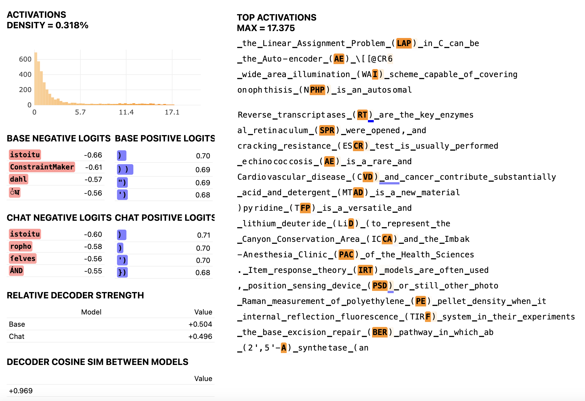

# Crosscoder Vis

This is a fork of Callum McDougall's [sae_vis](https://github.com/callummcdougall/sae_vis) that can generate latent dashboards for model-diffing [crosscoders](https://transformer-circuits.pub/2024/crosscoders/index.html). 

TODO: link demo and maybe blog post

Example dashboard:

The dashboards also have activating examples at other ranges (i.e. not just max activating), just like in sae_vis, not shown in the image.
## Motivation

In SAE research, I've found that investing in nice visualizations can be really helpful for rapidly interpreting latents, and (until now) there is no infra to generate latent dashboards for crosscoders. I hope this is helpful to other researchers.

**Warning:** I expect a bunch of sae_vis to be broken by my changes, and the code is rough and probably somewhat confusing. My implementation also assumes that the crosscoder was trained on two models, and the visualizations are set up to assume that the first decoder corresponds to a base model, and the second a chat fine-tuned model. I've only used it for a crosscoder trained on Gemma-2 2b base and IT residual streams. I'm not sure if it will work for crosscoders applied to other sites (attn, mlp, etc). I don't plan to maintain this or review PRs, please fork this and modify it if needed!